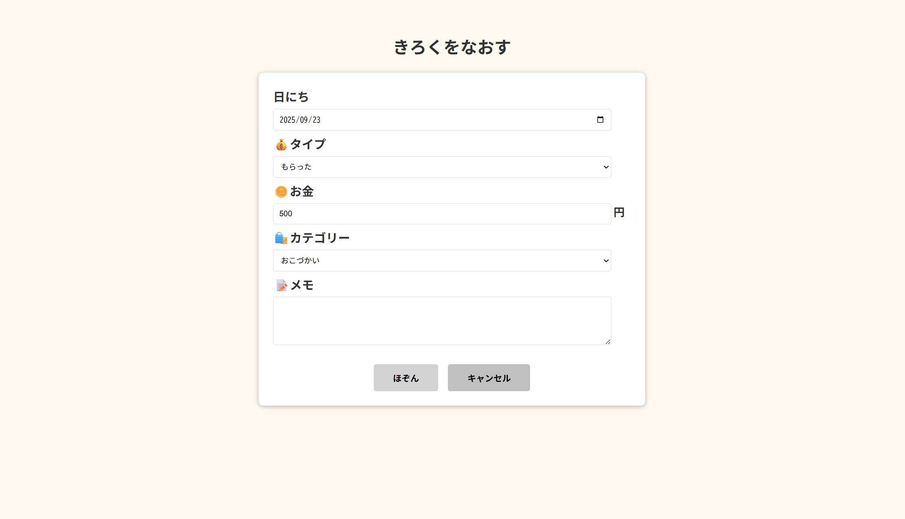

# kids Money Manager

## 概要

子供がお小遣いの収支を管理できる Web アプリケーション

## 開発期間

2025 年 7 月～ 2025 年 8 月(約 1 か月)

## 開発の目的

身近な課題を技術で解決する経験を積むため、実用的な Web アプリケーションの開発に取り組みました。
子供達が紙媒体でのお小遣いの管理が続きにくいという課題を、デジタル化することで解決するアプリケーションを設計・開発しました。

## ターゲット

小学生の子供
デジタルネイティブな子供世代

## 機能

- ユーザー登録・ログイン
- 収支の登録・編集・削除
- 収支記録の確認
- 残高表示
- カレンダー表示

## 技術スタック

### フロントエンド

- HTML5
- CSS3
- JavaScript

### バックエンド

- Java 21
- Spring Boot
- MyBatis

### データベース

- MySQL

### 開発環境

- Visual Studio Code
- Eclips
- MySQL Workbench

## 技術的な工夫点

- **セキュリティ対策**: パスワードを jBCrypt で暗号化、MyBatis の PreparedStatement で SQL インジェクション対策
- **API 設計**: RESTful API で設計(HTTP メソッドと URL で操作を表現)
- **データベース設計**: テーブルを正規化し、カテゴリーと記録を分離してデータの整合性を確保
- **ユーザビリティ**: 子供でも使いやすい UI、色弱の子供にもわかりやすく明暗やアイコンを追加
- **開発効率**: Maven で依存関係管理、フロントエンドとバックエンドを分離して並行開発

## 起動手順

### 必要な環境

- Java 21 以上
- Maven 3.9 以上
- MySQL 8.0 以上
- Visual Studio Code

### データベース起動

- MySQL Workbench で `Kids_okodukai_db` データベースを起動

### アプリケーション起動

1. **バックエンド起動**

   ```bash
   cd backend
   mvn spring-boot:run
   ```

   - API サーバーが `http://localhost:8080` で起動

2. **フロントエンド起動**
   - VSCode で `frontend/login.html` を開く
   - Live Server で `htttp://localhost:5500` でフロントエンドを表示

## API エンドポイント

### ユーザー管理

- `POST /kids/register` - ユーザー登録
- `POST /kids/login` - ログイン
- `GET /kids/{nickname}` - ユーザー情報取得
- `POST /kids/{nickname}/logout` - ログアウト

### カテゴリー管理

- `GET /kids/categories` - 全カテゴリー取得
- `GET /kids/categories/{recordType}` - タイプ別カテゴリー取得

### 収支記録

- `POST /kids/records` - 収支記録登録
- `GET /kids/user/{userId}/records` - ユーザーの収支記録一覧
- `PUT /kids/records/{recordId}` - 収支記録更新
- `DELETE /kids/records/{recordId}` - 収支記録削除
- `POST /kids/records/search` - 収支記録検索

### 残高管理

- `GET /kids/users/{userId}/balance` - 現在の残高取得
- `GET /kids/users/{userId}/balance/summary` - 収支サマリー取得

## プロジェクト構造

```text
kids-money-manager/
├── backend/ # バックエンド(Spring Boot)
│ ├── src/
│ │ ├── main/
│ │ │ ├── java/
│ │ │ │ └── com/example/app/
│ │ │ │ ├── controller/ # コントローラー
│ │ │ │ │ ├── BalanceController.java
│ │ │ │ │ ├── CategoryController.java
│ │ │ │ │ ├── RecordController.java
│ │ │ │ │ └── UserController.java
│ │ │ │ ├── dto/ # データ転送オブジェクト
│ │ │ │ ├── entity/ # エンティティ
│ │ │ │ ├── mapper/ # MyBatis マッパー
│ │ │ │ ├── service/ # サービス層
│ │ │ │ └── util/ # ユーティリティ
│ │ │ └── resources/
│ │ │ ├── mybatis/
│ │ │ │ ├── categoryMapper.xml
│ │ │ │ ├── RecordMapper.xml
│ │ │ │ └── UserMapper.xml
│ │ │ └── application.properties
│ │ └── test/ # テストコード
│ ├── target/ # ビルド成果物
│ └── pom.xml # Maven 設定
├── frontend/ # フロントエンド
│ ├── html/ # HTML ファイル
│ │ ├── login.html
│ │ ├── register.html
│ │ ├── calendar.html
│ │ ├── edit.html
│ │ ├── history.html
│ │ └── income.html
│ ├── script/ # JavaScript ファイル
│ │ ├── calendar.js
│ │ ├── edit.js
│ │ ├── history.js
│ │ ├── income.js
│ │ ├── login.js
│ │ ├── logout.js
│ │ └── register.js
│ └── style/ # CSS ファイル
│ ├── calendar.css
│ ├── edit.css
│ ├── history.css
│ ├── income.css
│ ├── login.css
│ └── register.css
├── .gitignore
└── README.md
```

## 開発の流れ

### 1.要件定義

- 子供がお小遣いを管理できるアプリの要件を整理
- 機能一覧の決定(登録・記録・確認・カレンダー表示)

### 2.技能選定

- **フロントエンド**: HTML/CSS/JavaScript
- **バックエンド**: Java/Spring Boot/MyBatis
- **データベース**: MySQL

### 3.データベース設計

- ユーザー、カテゴリー、収支記録のテーブル設計
- 正規化によるデータの整合性確保
- カテゴリーと記録の分離設計

### 4.API 設計

- RESTful API で設計
- フロントエンドとバックエンドの分離
- 各機能に対応するエンドポイントの定義

### 5.バックエンド開発

- Spring Boot で API サーバー構築
- MyBatis でデータベースアクセス
- セキュリティ対策(パスワード暗号化)

### 6.フロントエンド開発

- HTML/CSS/JavaScript で UI 構築
- 子供でも使いやすいデザイン、色弱にもわかりやすい UI
- API との連携処理

### 7.テスト・デバッグ

- フロントエンドとバックエンドの連携確認
- 全体の動作テスト
- ドキュメント整備

## デモ・スクリーンショット

### ログイン画面


- ユーザー名(ニックネーム)とパスワードでログイン
- シンプルで使いやすいデザイン

### 会員登録画面


- 新規ユーザーの登録
- バリデーション機能付き

### 収支登録画面


- 収入・支出の記録
- カテゴリー選択機能

### 収支履歴画面


- 過去の収支記録一覧
- 検索・フィルター機能

### カレンダー画面


- 月別カレンダー表示
- 収支の可視化

### 編集画面



- 収支記録の編集・削除
- 直感的な操作

## デモ動画

[デモ動画を見る](https://www.loom.com/share/bd7ce49cd0d44c19aa69c5eebe176e6d?sid=2a92f22e-ae83-45cb-8ef5-847f89381214)

## 今後の実装予定

### 1.親の管理画面

- 複数の子供の収支記録を管理可能
- 管理画面からの記録の追加・編集
- 子供へのメッセージ機能

### 2.グラフによる収支の可視化

- 円グラフや棒グラフによる収支割合や月ごとの収支の比較
- 折れ線グラフによる貯金額の推移

### 3.お小遣いの目標設定機能

- 金額や達成日を設定可能
- 達成日にポップアップでお祝い
- 目標に達する進捗バー
- 目標のカテゴリー分け
- 複数の目標管理が可能

## 技術的な進化

現在は既存の画面・機能を React, Node.js で作成中

- **フロントエンド**: HTML/CSS/JavaScript → React
- **バックエンド**: Java/Spring Boot → Node.js
- **目的**:よりモダンな技術スタックへの移行とパフォーマンス向上

```

```
